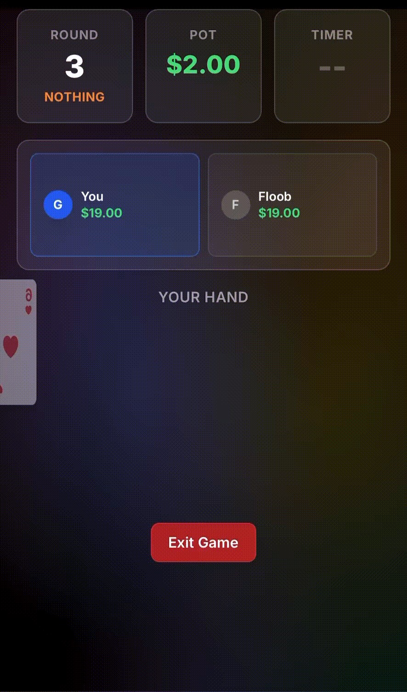

# GUTS Card Game

A real-time multiplayer card game built with a high-performance C++ backend and React frontend. Players compete in fast-paced poker-style rounds where they must decide whether to hold or drop their three-card hand.

Playable at: guts-production.up.railway.app
## Overview

GUTS is a house-rules poker variant designed for 2-8 players. Each round, players receive three cards and must decide within 30 seconds whether to stay in (hold) or fold (drop). The tension builds as players with the weakest hands face penalties, while a single holder must beat "THE DECK" to win the entire pot.

## Tech Stack

**Backend (C++)**
- Drogon (HTTP/WebSocket framework)
- OpenSSL (cryptographic card shuffling)
- nlohmann/json (JSON parsing)
- CMake (build system)

**Frontend (React)**
- React 18
- Vite (build tool)
- Zustand (state management)
- Tailwind CSS (styling)
- Native WebSocket API

**Deployment**
- Railway (hosting platform)
- Docker with BuildKit (containerization & build system)
- Multi-stage builds for optimized images

## Game Rules

### Setup
- **Players**: 2-8 players
- **Buy-in**: $5-$100 (configurable per player)
- **Ante**: $0.50 per round

### Round Types

**Rounds 1-3: "NOTHING" Rounds**
- Only pairs and three-of-a-kind count
- No straights or flushes
- Hand rankings: Three of a Kind > Pair > High Card

**Rounds 4+: Full Poker**
- All poker hands count
- Hand rankings: Straight Flush > Three of a Kind > Straight > Flush > Pair > High Card

### Gameplay

1. **Ante**: Each player pays $0.50 to the pot
2. **Deal**: Each player receives 3 cards (private)
3. **Decision**: 30-second timer to choose HOLD or DROP
4. **Resolution**:
   - **Everyone drops**: Pot carries over, each player adds $0.50
   - **Multiple holders**: Highest hand wins the pot, losers match the pot (carries to next round)
   - **Single holder vs THE DECK**:
     - Player wins → Takes pot, game ends
     - THE DECK wins → Player matches pot, game continues

### Special Rules

- Players in debt must buy back in before continuing
- Game continues until one player beats THE DECK in a solo showdown
- Debt tracking prevents players from leaving without settling

